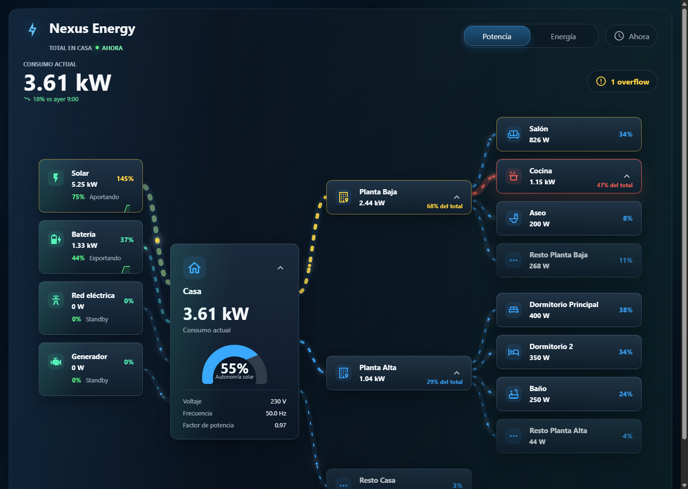
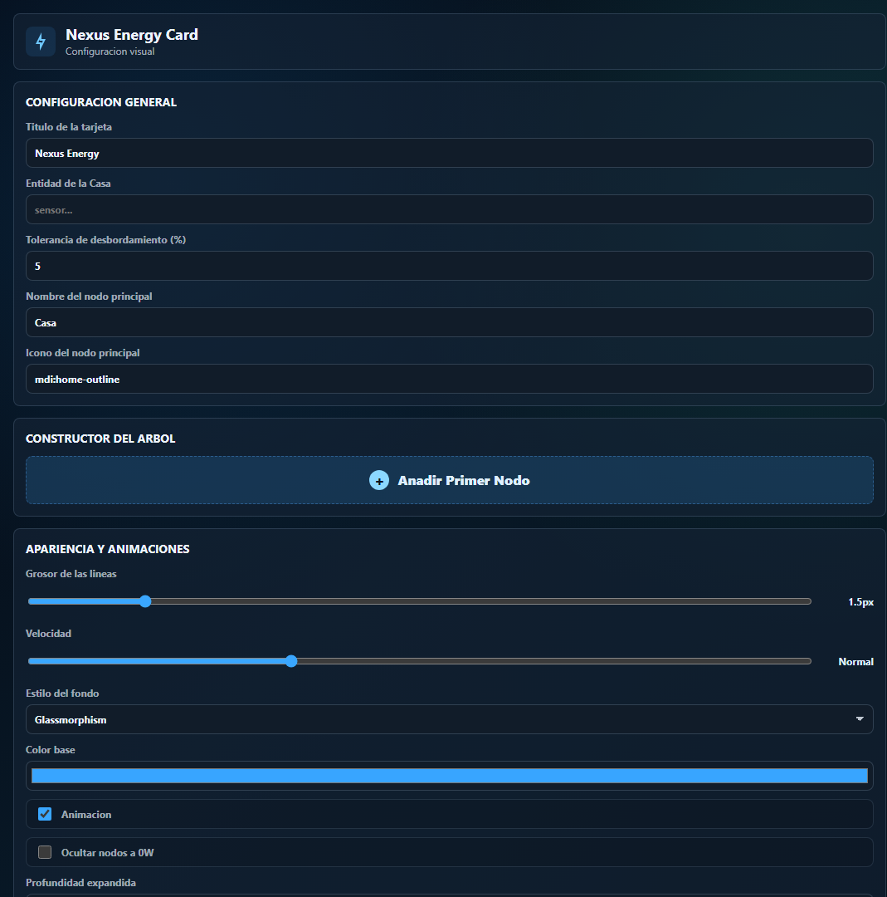

# Nexus Energy Card

Nexus Energy Card is a Home Assistant Lovelace dashboard card for visualizing live home power flow as a compact, hierarchical map. It shows energy sources, the main home load, rooms/devices, calculated remainder nodes, proportional Sankey-style flow widths, and a visual editor for building the tree without writing nested YAML by hand.





## Features

- Lovelace card type: `custom:nexus-energy-card`.
- Visual editor: `nexus-energy-card-editor`.
- HACS-compatible Dashboard plugin structure.
- Live power-focused UI with source -> home -> consumer routing.
- Strict hierarchical layout with centered parent nodes and aligned child columns.
- Calculated remainder nodes, currently displayed as `Resto [node]`, when a parent reports more power than its configured children.
- Configurable overflow tolerance to absorb small real-time sensor synchronization mismatches.
- Proportional SVG flow widths, animated particles, and warning/critical styling.
- Clean Bezier routing on desktop and compact views, plus an ultra-compact single-column mobile layout.
- Hover/tap tooltip with current value, parent percentage, and cached Home Assistant history sparkline.
- Visual tree builder with parent-child relationships, source nodes, polarity inversion, capacity, and color thresholds.
- Dark-mode friendly editor controls.
- Background styles: `glass`, `transparent`, and `solid`.

## HACS Compatibility

This repository is prepared as a HACS **Dashboard** repository. In HACS documentation this type is also called a `plugin`.

Required files included in this repository:

```text
hacs.json
dist/nexus-energy-card.js
README.md
images/nexus-energy-card-preview.png
images/nexus-energy-card-editor.png
.github/workflows/validate.yml
```

The HACS manifest is intentionally small:

```json
{
  "name": "Nexus Energy Card",
  "filename": "nexus-energy-card.js"
}
```

HACS will find `dist/nexus-energy-card.js` and install it as a dashboard resource.

For publication in HACS, also configure the GitHub repository itself:

- Make the repository public.
- Use a short GitHub description such as: `Hierarchical live power flow card for Home Assistant Lovelace`.
- Enable GitHub issues.
- Add useful topics, for example: `home-assistant`, `hacs`, `lovelace`, `dashboard`, `custom-card`, `energy`, `power`, `typescript`, `lit`.
- Publish GitHub releases, not only tags, when you want HACS users to receive versioned updates.
- Keep `dist/nexus-energy-card.js` available either on the default branch or attached to each release.

Official HACS references:

- General publishing requirements: https://www.hacs.xyz/docs/publish/start/
- Dashboard plugin requirements: https://www.hacs.xyz/docs/publish/plugin/
- HACS validation action: https://www.hacs.xyz/docs/publish/action/

## Installation

### Install with HACS

1. Open Home Assistant.
2. Go to **HACS**.
3. Open the three-dot menu.
4. Choose **Custom repositories**.
5. Add this repository URL.
6. Select category **Dashboard**.
7. Click **Add**.
8. Search for **Nexus Energy Card** in HACS.
9. Install it.
10. Restart Home Assistant or refresh the browser cache if the card does not appear immediately.

If HACS does not add the dashboard resource automatically, add it manually:

```yaml
url: /hacsfiles/nexus-energy-card/nexus-energy-card.js
type: module
```

### Manual installation

Build the card:

```bash
npm ci
npm run build
```

Copy the bundle to Home Assistant:

```text
dist/nexus-energy-card.js -> /config/www/nexus-energy-card.js
```

Add the dashboard resource:

```yaml
url: /local/nexus-energy-card.js
type: module
```

## Quick start

Add a new manual card or use the visual editor:

```yaml
type: custom:nexus-energy-card
title: Nexus Energy
sources:
  - id: grid
    name: Grid
    power_entity: sensor.grid_power
    icon: mdi:transmission-tower
nodes:
  - id: home
    name: Home
    power_entity: sensor.home_power
    icon: mdi:home-outline
    children:
      - id: kitchen
        name: Kitchen
        power_entity: sensor.kitchen_power
        icon: mdi:pot-steam-outline
      - id: lights
        name: Lights
        power_entity: sensor.lights_power
        icon: mdi:lightbulb-outline
```

The first item in `nodes` is treated as the main home node. Child nodes can be nested to build rooms, floors, circuits, or individual devices.

## Visual editor

The visual editor is the recommended setup path. New cards start empty, so no mock entities are injected into your Home Assistant configuration.

The editor includes:

- General card title and main home entity settings.
- Overflow tolerance.
- Node tree builder with collapsible rows.
- Source and consumer node creation.
- Parent selection for each node.
- Entity picker, display name, MDI icon, direction, capacity, and invert value.
- Appearance controls for line width, animation speed, background style, base color, zero-value node hiding, and default expanded depth.
- Per-node or global color thresholds.

## Full YAML example

```yaml
type: custom:nexus-energy-card
title: Nexus Energy
animation: true
animation_speed: 1
line_width_base: 1.5
overflow_tolerance: 5
background_style: glass
hide_zero_nodes: false
base_color: "#38a5ff"
default_expanded_depth: 2
thresholds:
  warning: 0.65
  critical: 0.85
color_thresholds:
  - node_id: kitchen
    above: 2000
    color: "#ffb000"
sources:
  - id: solar
    name: Solar
    power_entity: sensor.solar_power
    icon: mdi:white-balance-sunny
    capacity: 7
  - id: battery
    name: Battery
    power_entity: sensor.battery_power
    icon: mdi:battery-charging-60
    capacity: 3
    direction: auto
    invert_value: false
  - id: grid
    name: Grid
    power_entity: sensor.grid_power
    icon: mdi:transmission-tower
    capacity: 6
nodes:
  - id: home
    name: Home
    power_entity: sensor.home_power
    icon: mdi:home-outline
    capacity: 6
    children:
      - id: ground-floor
        name: Ground Floor
        power_entity: sensor.ground_floor_power
        icon: mdi:home-floor-0
        capacity: 3.5
        children:
          - id: living-room
            name: Living Room
            power_entity: sensor.living_room_power
            icon: mdi:sofa-outline
          - id: kitchen
            name: Kitchen
            power_entity: sensor.kitchen_power
            icon: mdi:pot-steam-outline
      - id: top-floor
        name: Top Floor
        power_entity: sensor.top_floor_power
        icon: mdi:home-floor-1
```

## Configuration reference

### Card options

| Key | Type | Default | Description |
| --- | --- | --- | --- |
| `title` | string | `Nexus Energy` | Card title. |
| `animation` | boolean | `true` | Enables moving particles on power flows. |
| `animation_speed` | number | `1` | Particle speed multiplier. |
| `line_width_base` | number | `1.5` | Minimum flow width used by proportional paths. |
| `overflow_tolerance` | number | `5` | Percentage margin used to ignore small child-over-parent sensor mismatches. |
| `background_style` | `glass`, `transparent`, `solid` | `glass` | Card background treatment. |
| `hide_zero_nodes` | boolean | `false` | Hides zero-value sources and devices. |
| `base_color` | color string | `#38a5ff` | Default flow and node accent color. |
| `default_expanded_depth` | number | `2` | Initial visible hierarchy depth. |
| `thresholds.warning` | number | `0.65` | Warning ratio for capacity or parent share. |
| `thresholds.critical` | number | `0.85` | Critical ratio for capacity or parent share. |
| `color_thresholds` | array | `[]` | Custom colors above configured watt values. |
| `sources` | array | `[]` | Source nodes such as solar, grid, battery, or generator. |
| `nodes` | array | `[]` | Main home node and nested consumer tree. |

### Node options

| Key | Type | Description |
| --- | --- | --- |
| `id` | string | Stable node identifier. Use lowercase IDs without spaces when possible. |
| `name` | string | Display name. |
| `entity` | string | Generic entity fallback. |
| `power_entity` | string | Power sensor entity, usually `device_class: power`. |
| `icon` | string | Material Design icon, for example `mdi:home-outline`. |
| `capacity` | number | Optional capacity used for warning and critical styling. |
| `direction` | `auto`, `import`, `export` | Flow direction behavior. Useful for sources and bidirectional sensors. |
| `invert_value` | boolean | Flips the sensor sign before direction is resolved. Useful for batteries and inverters. |
| `color` | color string | Optional node accent color. |
| `children` | array | Nested child nodes. |

### Color thresholds

`above` is interpreted as watts.

```yaml
color_thresholds:
  - node_id: "__all__"
    above: 2500
    color: "#ff6259"
  - node_id: kitchen
    above: 2000
    color: "#ffb000"
```

Use `node_id: "__all__"` for a global threshold.

## How calculations work

### Values

The card reads live power sensors and normalizes supported power units into kW internally. Display formatting chooses W or kW depending on the value.

### Remainder nodes

If a parent has more measured power than the sum of its visible children, the card creates a virtual remainder node. This helps reveal unmodeled consumption without requiring every device to be configured.

### Overflow tolerance

Real-time Home Assistant sensors often update at slightly different times. `overflow_tolerance` prevents small timing mismatches from being shown as errors.

Example:

```yaml
overflow_tolerance: 5
```

If children exceed the parent by 5% or less, the overflow is ignored and the remainder is treated as `0 W`.

### Tooltips and history

Hover a node on desktop or tap it on mobile to open a tooltip. The tooltip shows:

- Current raw entity value.
- Unit of measurement from Home Assistant attributes.
- Percentage relative to the parent node.
- Lightweight SVG sparkline.

History is requested from Home Assistant and cached for 60 seconds per entity to avoid repeated database calls while the user moves across the card.

## Responsive behavior

The card observes its own container width with `ResizeObserver`, which is important for Home Assistant masonry dashboards.

Layout modes:

| Container width | Layout |
| --- | --- |
| `> 600px` | Horizontal source -> home -> consumer map. |
| `381px - 600px` | Compact vertical layout with two-column child grids when space allows. |
| `<= 380px` | Ultra-compact single-column layout. |

Breakpoint hysteresis is used to prevent flickering when the card width sits near a boundary.

## Development

Install dependencies:

```bash
npm ci
```

Run the local demo:

```bash
npm run dev
```

Run checks:

```bash
npm run test
npm run build
npm run check
```

Local demo URLs:

```text
http://127.0.0.1:5173/
http://127.0.0.1:5173/?editor=1
http://127.0.0.1:5173/?editor=1&demo=1
```

If Vite selects another port because `5173` is busy, use the URL printed by `npm run dev`.

## Release workflow

1. Update `package.json` and `CHANGELOG.md`.
2. Run:

   ```bash
   npm run check
   ```

3. Commit source changes and the generated bundle:

   ```text
   dist/nexus-energy-card.js
   ```

4. Create a version tag:

   ```bash
   git tag v0.1.0
   git push origin v0.1.0
   ```

5. Publish a GitHub release for the tag.

The included release workflow builds the project and attaches `dist/nexus-energy-card.js` to the release.

## HACS validation

The repository includes `.github/workflows/validate.yml`.

It runs:

```yaml
category: plugin
```

This matches HACS Dashboard repositories.

## Troubleshooting

### The card does not appear in the card picker

- Clear the browser cache.
- Reload Home Assistant.
- Confirm the dashboard resource is loaded as `type: module`.
- Confirm the installed file is `nexus-energy-card.js`.

### The card shows no values

- Confirm each configured entity exists.
- Prefer power sensors with `device_class: power`.
- Check that the sensor state is numeric.
- For batteries or inverters, try `invert_value: true` or `direction: auto`.

### The visual tree looks incomplete

- Increase `default_expanded_depth`.
- Disable `hide_zero_nodes` while debugging.
- Check whether parent sensors and child sensors update at different intervals.

## Support

Please open a GitHub issue with:

- Home Assistant version.
- HACS version.
- Browser name and version.
- Card YAML or screenshots from the visual editor.
- Relevant browser console errors.

## License

MIT
